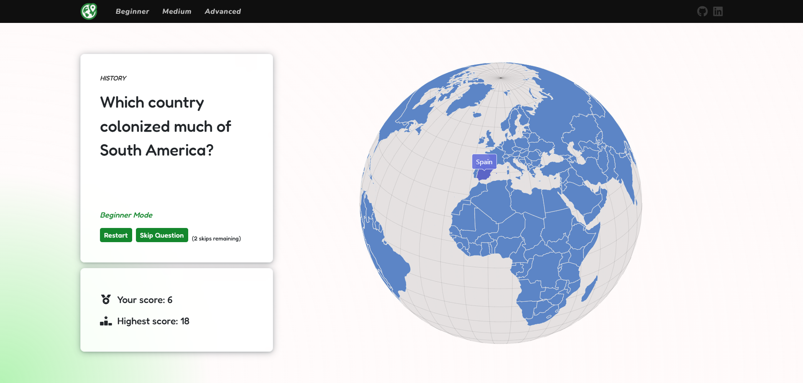
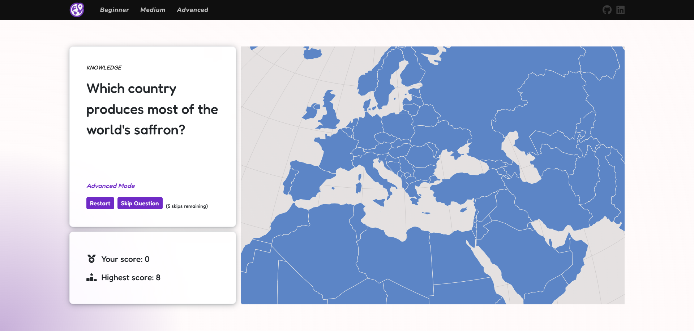

# GeoStrike-Game

GeoStrike is an interactive quiz app that helps users explore the world through five categories: Geography, History, Nature, Culture, and General Knowledge. Questions range from beginner-friendly to challenging, making it engaging even for enthusiasts. Everyone can learn at their own pace while competing for high scores, blending education with friendly competition.

## Game Modes

* 🟢 **Beginner** – Easy questions, perfect for relaxed play
* 🟠 **Medium** – A bit harder, with more variety to keep it interesting
* 🔴 **Advanced** – Tough questions for true geography experts

## Screenshots

## Responsiveness

The app is fully responsive and works on desktops, tablets, and phones.

[iPad-Mini](GeoStrike-Game/wwwroot/images/readme/ipad-mini.png)
[iPhone-10](GeoStrike-Game/wwwroot/images/readme/iphone-10.png)

## Technologies Used

* Blazor Web App
* JavaScript
* amCharts 5
